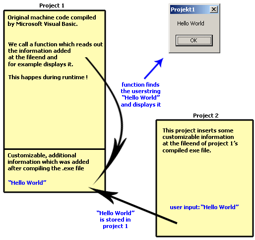



## \[\_Create\_EXE\_Files\_During\_Runtime\!\!\!\!\!\]

### Description

This tutorial explains how to create executable files during runtime ! Visual Basic does NOT even have to be installed on the computer running your Application !!!!

the bas file included in this project helps you to create exe files which include customized data! DURING RUNTIME!

"What we do is coding an exe file that opens itself for read access during runtime."

Reading the Tutorial won't last longer than 10 minutes and the method you learn can be very EFFECTIVE.
 
### More Info
 

             |
---                |---
**Submitted On**   |2002-10-15 02:42:18
**By**             |[over](https://github.com/Planet-Source-Code/PSCIndex/blob/master/ByAuthor/over.md)
**Level**          |Advanced
**User Rating**    |4.6 (125 globes from 27 users)
**Compatibility**  |VB 5\.0, VB 6\.0
**Category**       |[Files/ File Controls/ Input/ Output](https://github.com/Planet-Source-Code/PSCIndex/blob/master/ByCategory/files-file-controls-input-output__1-3.md)
**World**          |[Visual Basic](https://github.com/Planet-Source-Code/PSCIndex/blob/master/ByWorld/visual-basic.md)
**Archive File**   |[\[\_Create\_E14770710172002\.zip](https://github.com/Planet-Source-Code/over-create-exe-files-during-runtime__1-39917/archive/master.zip)

